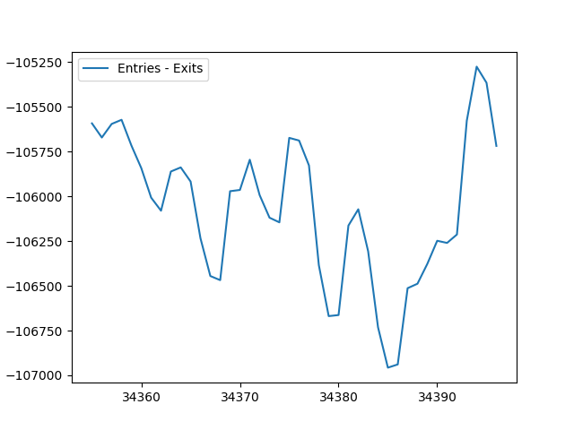

# Brownsville

link: https://konstantsmh.github.io/konstantsmh.github.io/

**Zip Code**: 11212

**Census Tracts**: 900, 902, 894, 898, 896, 922, 916, 922, 918, 920, 912, 910, 906, 908, 365, 361, 303, 363

**Demographics**: 76% Black, 20% Hispanic, 2% Other, 1% White, 1% Asian

**Total Population**: 86,377

**Distance To Federal Hall**: 6.09 miles

**Distance to Empire State Building**: 7.11 miles 

