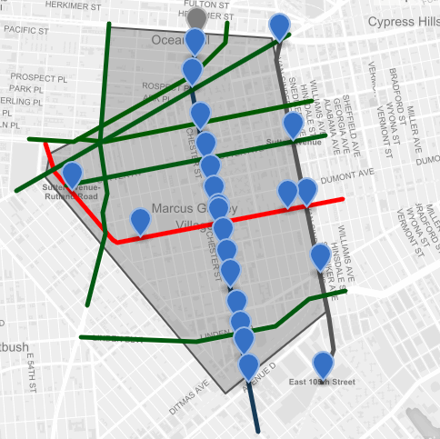

# Brownsville

link: https://konstantsmh.github.io/konstantsmh.github.io/

**Zip Code**: 11212

**Census Tracts**: 900, 902, 894, 898, 896, 922, 916, 922, 918, 920, 912, 910, 906, 908, 365, 361, 303, 363

**Demographics**: 76% Black, 20% Hispanic, 2% Other, 1% White, 1% Asian

**Total Population**: 86,377

**Distance To Federal Hall**: 6.09 miles

**Distance to Empire State Building**: 7.11 miles 

The closure of the L train should not have
any major effects on the residents of
Brownsville. For service to any area in
Manhattan that the L train reaches, residents
can take a short walk to the A, C, J, Z, or 3
trains, which all travel to Manhattan. For
service to any area in Brooklyn, the L train
still runs between Lorimer Street and Carnarsie
Rockaway Parkway. Although these routes
are all relatively close and convenient for
Brownsville residents, there may be concerns
of overcrowding due to increased ridership.
